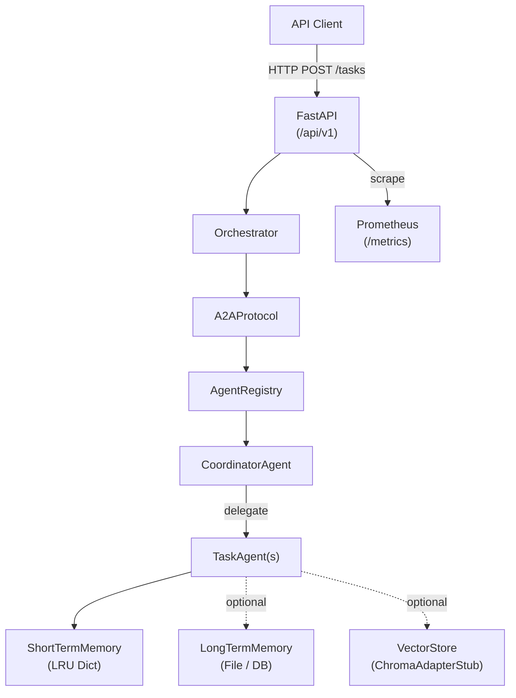

# Agentic AI Core Framework

> Production-grade, async-first multi-agent orchestration platform built with Python 3.11+, FastAPI, and Pydantic v2.

---

## Architecture



---

## Features

| Capability | Implementation |
|---|---|
| Agent abstraction | `BaseAgent` ABC with lifecycle hooks |
| Agent discovery | `AgentRegistry` (async, thread-safe) |
| A2A messaging | `A2AProtocol` with timeout & error wrapping |
| Structured payloads | Pydantic v2 schemas (`A2AMessage`, `AgentResponse`) |
| Short-term memory | LRU in-process `ShortTermMemory` |
| Long-term memory | File-backed `LongTermMemory` (swap for Redis/PG) |
| Vector retrieval | `ChromaAdapterStub` (swap for real ChromaDB) |
| Structured logging | JSON logs via custom `logging.Formatter` |
| Metrics | Prometheus counters + histograms via `prometheus-client` |
| REST API | FastAPI with OpenAPI docs at `/docs` |
| Containerisation | Dockerfile + docker-compose |

---

## Quick Start

```bash
# 1. Clone and install
git clone <repo-url>
cd agentic-ai-core-framework
cp .env.example .env
pip install -r requirements.txt

# 2. Run locally
make run

# 3. Run tests
make test

# 4. Docker
make docker-up
```

API docs available at: http://localhost:8000/docs
Metrics: http://localhost:8000/metrics

---

## Project Structure

```
├── src/
│   ├── agents/          # BaseAgent, Registry, CoordinatorAgent, TaskAgent
│   ├── memory/          # BaseMemory, ShortTermMemory, LongTermMemory
│   ├── protocol/        # A2AMessage schema, A2AProtocol handler
│   ├── retrieval/       # BaseVectorStore, ChromaAdapterStub
│   ├── api/             # FastAPI app & routers
│   └── core/            # Orchestrator, Settings, Logging, Metrics
├── tests/               # pytest async tests
├── config/              # Settings re-export
├── docker/              # Dockerfile, docker-compose.yml
├── Makefile
├── requirements.txt
└── .env.example
```

---

## Design Decisions

### 1. Async-first
All agent handlers, memory operations, and protocol dispatches are `async def`. This allows high concurrency without threading overhead.

### 2. Pydantic v2 Schemas
`A2AMessage` and `AgentResponse` enforce a strict wire contract. Any agent input/output is validated at the boundary.

### 3. Registry-based discovery
Agents register themselves at startup. The `A2AProtocol` resolves targets by ID or type—no hard-coded wiring.

### 4. Pluggable memory and storage
`BaseMemory` and `BaseVectorStore` are abstract interfaces. Swap in Redis, PostgreSQL, or ChromaDB without touching agent logic.

### 5. Structured JSON logs
Every log entry is machine-parseable JSON, enabling direct ingestion into ELK, Loki, or CloudWatch.

---

## How to Add a New Agent

1. **Create** `src/agents/my_agent.py` extending `BaseAgent`:

```python
from src.agents.base_agent import BaseAgent
from src.protocol.message_schema import A2AMessage, AgentResponse, MessageType

class MyAgent(BaseAgent):
    AGENT_TYPE = "my_agent"

    def __init__(self) -> None:
        super().__init__(agent_type=self.AGENT_TYPE, capabilities=["my_capability"])

    async def startup(self) -> None: ...
    async def shutdown(self) -> None: ...

    async def handle(self, message: A2AMessage) -> AgentResponse:
        # implement your logic
        return AgentResponse(
            agent_id=self.agent_id,
            message_id=message.message_id,
            success=True,
            payload={"result": "done"},
        )
```

2. **Register** it in `src/core/orchestrator.py`:

```python
from src.agents.my_agent import MyAgent
my_agent = MyAgent()
await self.registry.register(my_agent)
```

3. **Test** it in `tests/test_my_agent.py` following the patterns in `tests/test_agents.py`.

---

## Extension Guide

| What to extend | Where |
|---|---|
| Add persistent memory | Implement `BaseMemory`, inject into agent |
| Add real vector store | Implement `BaseVectorStore` in `src/retrieval/` |
| Add authentication | FastAPI middleware in `src/api/main.py` |
| Add message queue | Replace `A2AProtocol.dispatch` with queue broker |
| Add tracing | Inject OpenTelemetry spans into `A2AProtocol` |

---

## API Reference

| Method | Path | Description |
|---|---|---|
| POST | `/api/v1/tasks` | Submit a task to the orchestrator |
| GET | `/api/v1/agents` | List all registered agents |
| GET | `/api/v1/agents/{id}/health` | Health check for a specific agent |
| GET | `/api/v1/health` | System health |
| GET | `/metrics` | Prometheus metrics scrape endpoint |

---

## License

MIT
